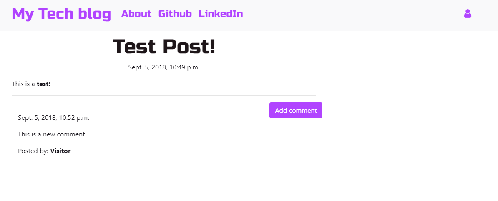

<!--
*** Thanks for checking out this README Template. If you have a suggestion that would
*** make this better, please fork the repo and create a pull request or simply open
*** an issue with the tag "enhancement".
*** Thanks again! Now go create something AMAZING! :D
***
***
***
*** To avoid retyping too much info. Do a search and replace for the following:
*** github_username, repo, twitter_handle, email
-->

<!-- PROJECT LOGO -->
 

  

  <h3 align="center">DJANGO_BLOG_SITE</h3>

<!-- TABLE OF CONTENTS -->
## Table of Contents

* [About the Project](#about-the-project)
  * [Built With](#built-with)
* [Contributing](#contributing)

<!-- ABOUT THE PROJECT -->
Django Blog Site is a simple website that handles adding post, comments and superusers.

[![Product Name Screen Shot][product-screenshot]](https://example.com)

Here's a blank template to get started:
**To avoid retyping too much info. Do a search and replace with your text editor for the following:**
`github_username`, `repo`, `twitter_handle`, `email`

### Built With

* [Django]()
* [Python]()
* [Atom]()

<!-- CONTRIBUTING -->
## Contributing

Paweł Brzóska
Jose Portilla

